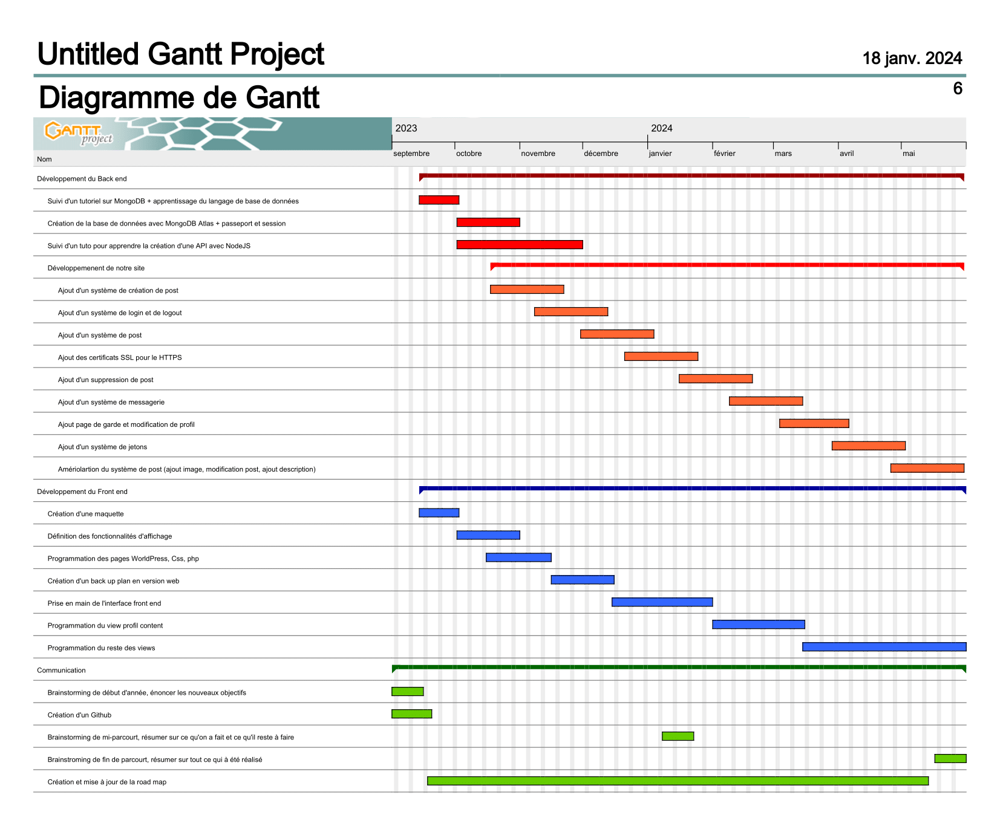

**Roadmap du projet :**

    

**Sécurité :**
Il ne faut pas négliger l'aspect sécurité de notre projet afin que notre site respecte les normes du RGPD. Il sera également nécessaire de se prémunir contre les attaques de type DDoS, étant donné que la base de données est relativement petite en raison de l'utilisation des services gratuits de MongoDB Atlas.

Actuellement, nous en sommes à une phase de développement où notre priorité est d'implémenter les différentes fonctionnalités nécessaires au bon fonctionnement de notre site. La question de la sécurité sera abordée dans un second temps, si nous parvenons à être en avance par rapport aux délais estimés de notre roadmap.

**Les difficultés rencontrées lors du développement :**

Au sein de notre groupe nous sommes deux personnes en spécialité informatique (qu'une seule pour le seconde semestre) et quatre personnes en spécialité TIS. Les personnes en spécialité informatiques ont eu de nombreux cours sur des méthodes de développement et l'utilisation de git par exemple. Ils ont aussi eu des cours sur node js et sur l'utilisation de différentes librairie destinées à node js et sur le développement web. Le fait est qu'il est compliqué pour les membres du groupe étant en TIS car ils n'ont aucun cours de développement (même pour git par exemple). Ce qui fait que lors des séances de travails communes, la majorité du temps est consacré à essayer de faire fonctionner le code sur leur machine car ils développent sur Windows et nous Linux. Donc pour ne pas créer de conflit ils implémentent des fonctions de leur côté et que ensuite nous intégrons dans le code. Cela complique beaucoup le développement car nous ne pouvons pas travailler tous ensemble sur le même code et la répartition des tâches se complexifie de plus en plus au fur et à mesure que le projet avance. Les membres du groupe étant en TIS comparé au membre du groupe étant en TI ont "3 cours en plus à suivre" en développant ce projet car il y a beaucoup de choses à apprendre pour pouvoir développer une application web.

De nombreux bugs sont présents sur notre site mais nous essayons de les corriger au fur et à mesure que nous les trouvons. Par exemple en essayant de créer un nouvel échange avec l'url https://localhost/trades/new sans être connecté cela va faire crasher notre site. Les échanges peuvent aussi être modifié par n'importe quel utilisateur. Il faudra donc créer un système de droit sur qui peut modifier quel information sur notre site en fonction de qui l'a créé.
