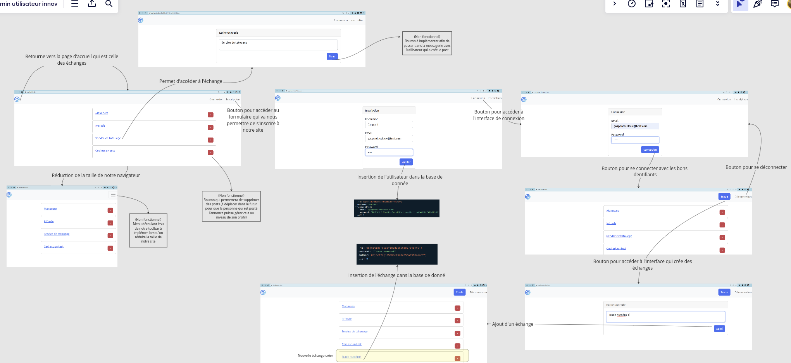

#Manuel d'utilisattion du projet

    

Ce fichier a pour but de décrire le fonctionnement de l'application et de décrire les différentes fonctionnalités de l'application. Pour cela on va décrire les différentes pages de l'application et les différentes fonctionnalités de l'application.

Lorsque vous arrivez sur le site la page d'accueil est la page des échanges. Sur cette page vous pouvez voir les différents échanges qui ont été postés par les utilisateurs. Vous pouvez ensuite accéder à chaque échange en cliquant sur le titre de l'échange. Pour l'instant les échanges possède juste un titre et n'ont pas encore de description, de photo ou un nombre de token requis pour participer à l'échange. Nous avons créer le bouton send pour qu'après une messagerie soit disponible pour que deux clients puissent discuter entre eux. Nous avons aussi créer un bouton delete (qui ne fonctionne pas encore) dans la page d'accueil https://localhost/trades  qui sera déplacer dans le futur dans la page du profil de l'utilisateur qui a créé l'échange de manière à ce que seul l'utilisateur qui a créé l'échange puisse le supprimer et le modifier.
Pour créer un échange vous devez suivre les étapes suivantes :
- Cliquer sur le bouton "Inscription" en haut à droite de la page d'accueil
- Remplir le formulaire d'inscription pour créer un compte
- Cliquer sur le bouton "Connexion" en haut à droite de la page d'accueil
- Remplir le formulaire de connexion pour se connecter à son compte avec les identifiants que vous avez renseigné lors de l'inscription
- Cliquer sur le bouton "Trade" en haut à droite de la page d'accueil afin d'accéder à la page de création d'échange
- Remplir le formulaire de création d'échange et cliquer sur le bouton "Send" pour créer l'échange

En suivant ces étapes vous avez créé un échange et vous pouvez le voir dans la page d'accueil. 

Le site possède une toolbar en haut de la page qui permet de naviguer entre les différentes pages du site. Vous pouvez naviguer entre les pages suivantes mentionnés précédemment :
- Accueil (via le logo en haut à gauche) : https://localhost/trades
- Connexion : https://localhost/auth/signin/form
- Inscription :https://localhost/users/signup/form
- Création d'échange : https://localhost/trades/new (il faut être connecté pour accéder à cette page sinon lorsqu'on crée un échange sans être connecté cela fait crasher le site)
Cette toolbar est disponible sur toutes les pages du site et lorsqu'on réduit la taille de notre fenêtre la toolbar se transforme en un menu déroulant qui permet d'accéder aux différentes pages du site. Cependant cette feature n'est pas encore foncitonnelle.